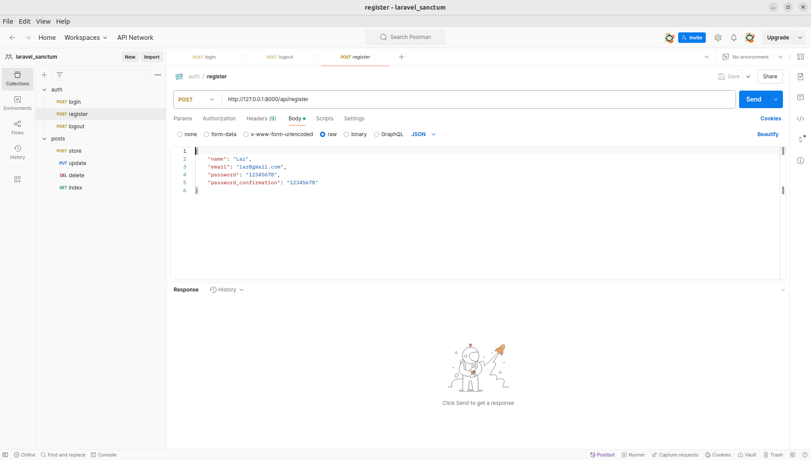
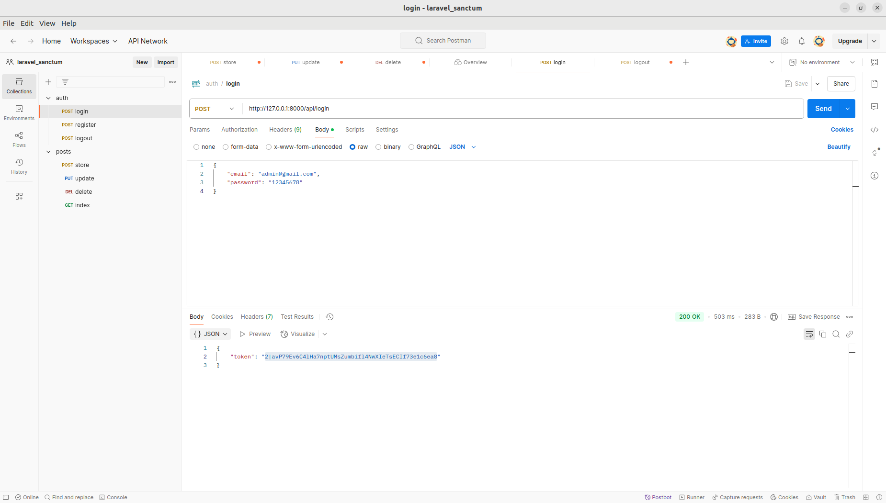
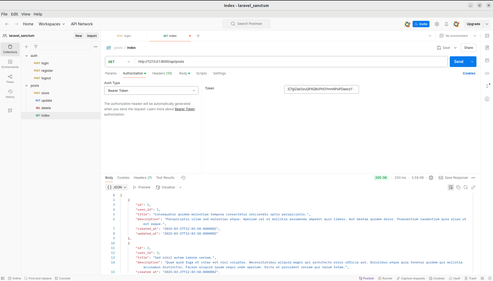
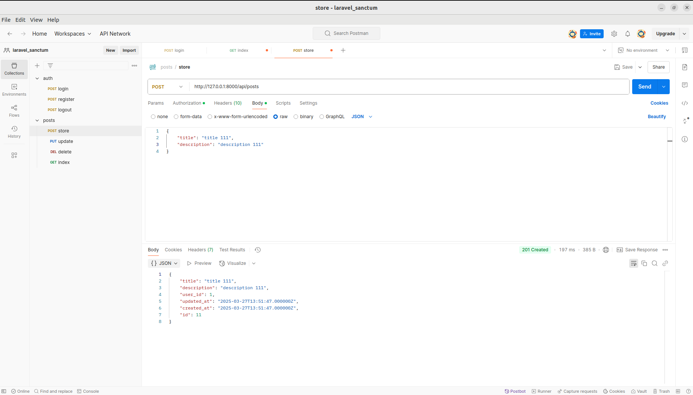
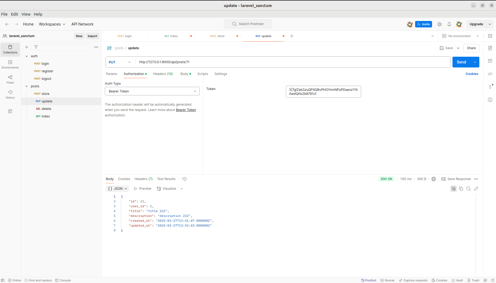
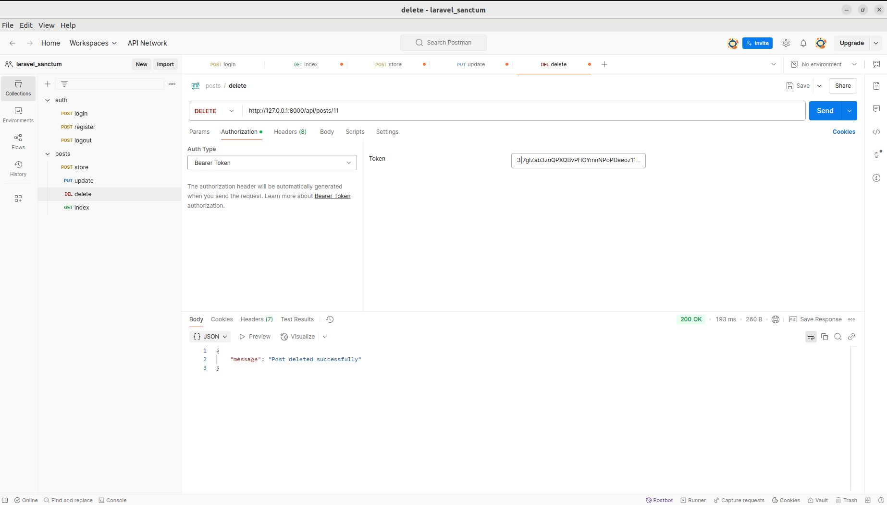

<p align="center"><a href="https://laravel.com" target="_blank"></a></p>

<p align="center">
<a href="https://github.com/laravel/framework/actions"></a>
<a href="https://packagist.org/packages/laravel/framework"></a>
<a href="https://packagist.org/packages/laravel/framework"></a>
<a href="https://packagist.org/packages/laravel/framework"></a>
</p>

# Laravel Sanctum API Project

This is a simple Laravel project set up with Sanctum for API authentication.

## Scaffolding

```bash
composer create-project laravel/laravel .
composer require laravel/ui
php artisan ui bootstrap --auth
npm install
npm run dev
php artisan serve
php artisan migrate --seed
http://127.0.0.1:8000/
```

## Sanctum

```bash
php artisan install:api
```

## Auth

app/Http/Controllers/Api/AuthController.php
```bash
php artisan make:controller Api/AuthController
```

use HasApiTokens at app/Models/User.php
```bash
use Laravel\Sanctum\HasApiTokens;

class User extends Authenticatable
{
    use HasApiTokens, Notifiable;
}
```
add api routes at routes/api.php
```bash
Route::post('register', [AuthController::class, 'register']);
Route::post('login', [AuthController::class, 'login']);
Route::post('logout', [AuthController::class, 'logout'])->middleware('auth:sanctum');
```

## Auth Postman

registration url: 
```bash
http://127.0.0.1:8000/api/register
```
Headers: 
```bash
Key:Accept Value:application/json
```
Body raw JSON
```bash
{
    "name": "Laz",
    "email": "laz@gmail.com",
    "password": "12345678",
    "password_confirmation": "12345678"
}
```


login url: 
```bash
http://127.0.0.1:8000/api/login
```
Headers: 
```bash
Key:Accept Value:application/json
```
Body raw JSON
```bash
{
    "email": "laz@gmail.com",
    "password": "12345678",
}
```


logout url: 
```bash
http://127.0.0.1:8000/api/logout
```
Headers: 
```bash
Key:Accept Value:application/json
```
Authorization: Bearer Token
```bash
2|avP79Ev6C4lHa7nptUMsZumbifl4NwXIeTsECIf73e1c6ea8
```


## Post
```bash
php artisan make:model Post -mfs
```
- `app/Models/Post.php`  
- `app/Models/User.php`  
- `database/migrations/2025_03_25_132601_create_posts_table.php`  
- `database/factories/PostFactory.php`  
- `database/seeders/PostSeeder.php`
  
## Post Policy
app/Policies/PostPolicy.php
```bash
php artisan make:policy PostPolicy --model=Post
```
## Post Postman

post index: 
```bash
http://127.0.0.1:8000/api/posts
```
Headers: 
```bash
Key:Accept Value:application/json
```
Authorization: Bearer Token
```bash
2|avP79Ev6C4lHa7nptUMsZumbifl4NwXIeTsECIf73e1c6ea8
```


create post: 
```bash
http://127.0.0.1:8000/api/posts
```
Headers: 
```bash
Key:Accept Value:application/json
```
Authorization: Bearer Token
```bash
2|avP79Ev6C4lHa7nptUMsZumbifl4NwXIeTsECIf73e1c6ea8
```
Body raw JSON
```bash
{
    "title": "title 111",
    "description": "description 111"
}
```


update post:

```bash
http://127.0.0.1:8000/api/posts/11
```
Headers: 
```bash
Key:Accept Value:application/json
```
Authorization: Bearer Token
```bash
2|avP79Ev6C4lHa7nptUMsZumbifl4NwXIeTsECIf73e1c6ea8
```
Body raw JSON
```bash
{
    "title": "title update",
    "description": "description update"
}
```


delete post: 
```bash
http://127.0.0.1:8000/api/posts/11
```
Headers: 
```bash
Key:Accept Value:application/json
```
Authorization: Bearer Token
```bash
2|avP79Ev6C4lHa7nptUMsZumbifl4NwXIeTsECIf73e1c6ea8
```


### Github

```bash
If you download this project from Github

composer install
npm install
connect database to .env
php artisan key:generate
php artisan storage:link
php artisan migrate --seed
npm run dev
php artisan serve
```
